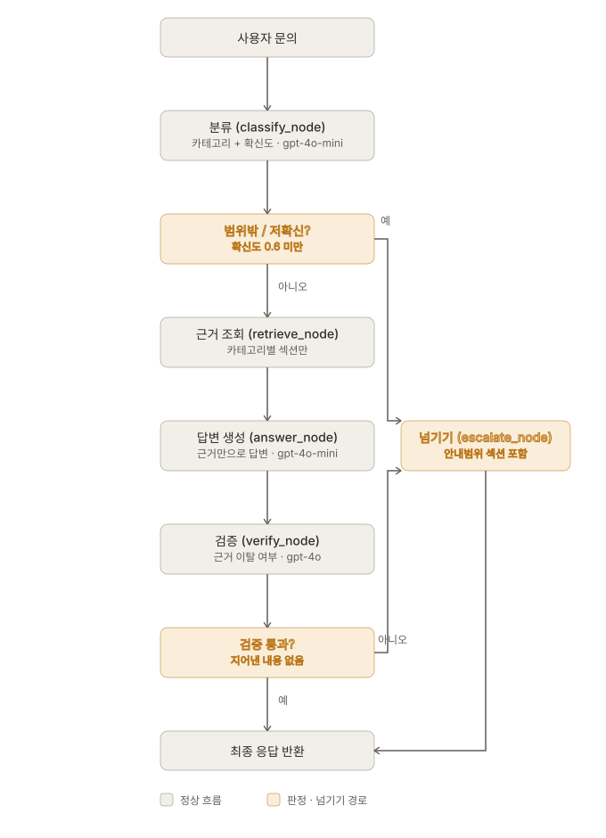
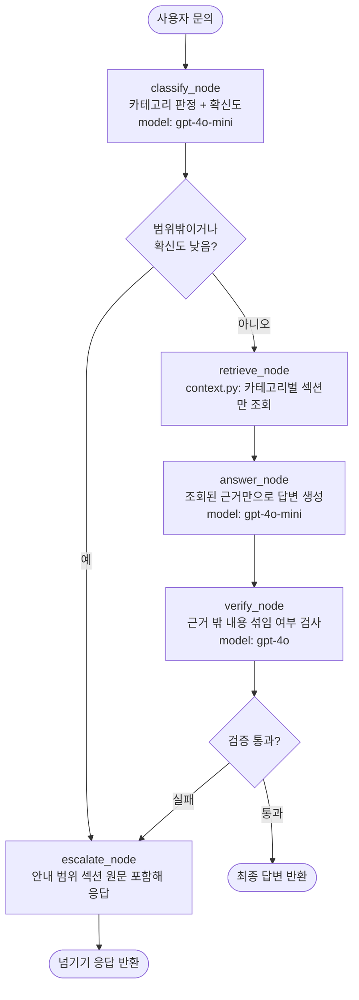

# REPORT — SME AI 주치의 고객 문의 응대 라우팅 에이전트

## 1. 주제와 근거 문서

**주제**: "SME AI 주치의" 컨설팅 서비스(진단 → PoC → PRD → MVP 4단계로 중소기업의 반복업무에 작은 AI Agent를 도입하는 프로세스)에 대해, 서비스를 검토 중인 중소기업 대표/실무 담당자의 문의에 응대하는 에이전트.

이 도메인을 고른 이유는 두 가지다.

- 실제 진행 중인 다른 프로젝트([`sme-ai-agent-domain`](../sme-ai-agent-domain))에서 이미 확정된 나의 업무 도메인이라, 이번 과제를 별도 아이디어로 처음부터 만드는 대신 실제 맥락과 연결해 진행할 수 있었다.
- "고객응대"라는 소재에 그 프로젝트가 그대로 들어맞는다 — 실제로 이 서비스를 문의할 만한 대상(중소기업 대표)이 존재하고, 진단/PoC/PRD/MVP라는 서로 답이 다른 절차가 이미 문서화되어 있었다.

**근거 문서**: [`docs/sme_ai_doctor_service_manual.md`](docs/sme_ai_doctor_service_manual.md). 기존에 있던 3개의 내부 실무 문서(도메인 결정 로드맵, 5차원 진단 인터뷰 질문지, PoC/PRD/MVP 표준 프로세스)를 고객 응대용 언어로 재구성해 하나의 매뉴얼로 통합했다. 카테고리 경계에 맞춰 `## 진단` / `## PoC` / `## PRD` / `## MVP` / `## 안내 범위` 5개의 `##` 헤더로 나눴고, 이 헤더가 그대로 카테고리별 근거 조각의 경계가 된다. 마지막 `## 안내 범위` 섹션에는 "비용·계약조건·일정 협의·타 산업 법률 자문은 다루지 않는다"는 문장을 실제로 넣어, 범위 밖 문의에 대한 근거(넘겨야 한다는 판단 근거)로 활용했다.

## 2. 카테고리 설계

카테고리는 서비스가 실제로 진행되는 절차 순서(진단→PoC→PRD→MVP)를 그대로 따르고, 여기에 절차 밖 문의를 담을 카테고리 하나를 추가해 5개로 구성했다. "왜 이렇게 나눴는가"는 "각 단계가 서로 다른 목적·산출물·소요기간을 가지고, 답변 내용이 실질적으로 겹치지 않는다"는 것이다.

| 카테고리 | 설명 (어떤 문의인가) | 매핑되는 문서 섹션 | 분류 근거 |
|---|---|---|---|
| 진단 | 5차원 프레임워크, 인터뷰 진행방식·횟수, 진단 산출물 | `## 진단` | 서비스의 첫 단계 — "우리 회사가 대상이 되는가"를 판단하는 절차 |
| PoC | PoC 진행 여부·기간·산출물·대표 공유 여부 | `## PoC` | 기술 검증 단계 |
| PRD | PRD 7개 항목, 핵심기능 개수 제한, 계약·서명 여부 | `## PRD` | 범위·성공기준을 확정하는 절차 |
| MVP | MVP 완성도 기준, 테스트 데이터, 구현 방식 | `## MVP` | 실사용 가능 여부를 확인하는 마지막 절차 |
| 범위 밖 | 비용, 계약 기간·조건, 타 산업 법률/세무 자문 등 | `## 안내 범위` (실질 근거 없음 — "다루지 않는다"는 사실 자체가 근거) | 문서 어디에도 답이 없음 — 지어내지 않고 넘기는 것이 정답 |

매핑표 원본은 [`docs/category_mapping.md`](docs/category_mapping.md)에 있으며, 판정 규칙(두 카테고리에 걸친 질문은 주된 의도 기준으로 하나만 고른다 등)도 함께 정리했다. 이 매핑은 `context.py`의 `CATEGORY_TO_SECTION` 딕셔너리로 그대로 코드화되어, 카테고리가 정해지면 해당 섹션 본문만 프롬프트에 들어가도록 구현했다(전체 문서를 넣지 않음).

## 3. 평가셋 설계

[`data/eval_set.csv`](data/eval_set.csv) 16건 + [`data/answer_gold.json`](data/answer_gold.json)으로 구성했다.

- **개수·균형**: 진단 4건, PoC 3건, PRD 3건, MVP 2건, 범위밖 4건. 카테고리당 최소 2건 이상.
- **기대 도구·필수 사실·금지 사실**: 문항마다 `expected_tool`(조회해야 할 근거 섹션, 또는 "넘기기"), `must_include`(반드시 담아야 할 사실), `must_not_include`(문서를 안 읽었을 때 나올 법한 그럴듯한 오답)를 명시했다. `answer_gold.json`의 `must_not_include`가 바로 "그럴듯한 오답" 자리다 — 예를 들어 비용 문의(q12)의 금지 사실은 "구체적인 금액이나 가격대(예: 300만원부터)"로, 실제로 파이프라인이 숫자를 지어내는지를 이 항목이 잡아낸다.
- **난이도**: `difficulty` 열로 easy 8건 / hard 8건을 구분했다. hard 문항은 세 가지 패턴을 노렸다 — ① 카테고리 경계에서 헷갈리는 단어가 있는 질문(q09: "계약을 체결하나요?" — PRD 절차 안의 구두합의를 묻는 것인데 "계약"이라는 단어 때문에 범위밖으로 오분류되기 쉬움) ② 카테고리 안에서 근거에 없는 구체적 기준을 묻는 질문(q15: 진단 커트라인 점수 — 없는 숫자를 지어내기 쉬움) ③ 거짓 전제를 확인해달라는 질문(q16: "계약금이 500만원이라던데 맞나요?" — 틀린 전제를 그대로 인정해버리기 쉬움).
- **범위 밖 문항**: 4건(q12 비용, q13 계약기간, q14 법률자문, q16 거짓 전제 비용)을 넣어 "넘기는 것이 정답인 문항"을 확보했다 — 이게 없으면 넘기기 경로 자체를 잴 수 없다.
- **예시/채점 분리**: `split` 열로 `example`(2건, q01·q04)과 `eval`(14건, 실제 채점 대상)을 분리했다. `prompts.py`의 few-shot은 `split=example` 행만 자동으로 불러오도록 코드로 강제해, 채점 문항이 프롬프트에 섞여 점수가 부풀려지는 것을 막았다.

## 4. 측정 결과

### 파이프라인 구조 (측정 대상)

`classify → (범위밖/저확신 → 넘기기)` → `retrieve → answer → verify → (검증실패 → 넘기기)` 구조로, **도구 호출 적절성**(실제 조회한 근거 = `tool_used`)과 **답변 적절성**(필수 사실 포함 + 금지 사실 미포함, LLM 채점)을 `evaluate.py`로 측정했다.

### 최종 수치

| 지표 | 값 |
|---|---|
| 도구 호출 적절성 (정확도) | **100%** |
| 도구 호출 적절성 (macro F1) | **1.000** |
| 답변 적절성 (정확도) | **85.71%** (예시 오염 없는 기준) / **100%** (마지막 라운드 기준, 아래 한계 참고) |

혼동행렬(최종, 5×5, 완전 대각): 진단 3/3, PoC 2/2, PRD 3/3, MVP 2/2, 넘기기 4/4 — 오분류 없음.

### 개선 과정 (11라운드) 요약

전체 라운드별 수치·원인 분석은 [`data/improvement_log.md`](data/improvement_log.md)에 있다. 핵심만 요약하면:

| 단계 | 변경 | 결과 |
|---|---|---|
| 초기 | 기본 파이프라인 | 답변 적절성 57% — verify가 정상 답변 끝의 상담 안내 문구를 "근거에 없는 내용"으로 오판 |
| 프롬프트 수정 1 | 답변 종결부 규칙 명확화 | 개선 |
| `temperature=0` 고정 | 재현성 확보 | 이후 라운드부터 비교 가능한 베이스라인 성립 |
| 넘기기 메시지 개선 | 고정 문구 대신 `## 안내 범위` 섹션 원문 포함 | 범위밖 문항 답변 개선 |
| 채점 기준 정교화 | "부정문/주제명 언급은 위반 아님" 명시 | 채점 오탐 감소 |
| **채점 모델 교체** | 채점자만 `gpt-4o-mini` → `gpt-4o` | 동일 답변도 판정이 흔들리던 채점기 신뢰도 문제 해결 |
| **verify 프롬프트 수정** | "정직하게 모른다고 말한 것은 위반 아님" 명시 | 도구 호출 적절성 100% 달성 |
| **answer 프롬프트에 구체 예시 추가** | 추상적 규칙 대신 실패 패턴을 그대로 본뜬 예시 2개 | 답변 적절성 100% 달성 |
| 비용 재확인 | `answer_node`를 다시 mini로 되돌려도 동일 성능 | 최종 구성: classify/answer=mini, verify=gpt-4o |

### 실패 원인 분류 (직접 읽고 분류한 것)

- **분류기의 키워드 과민 반응**: "계약"이라는 단어만으로 PRD 절차 안의 정상적인 내용(구두 합의)을 범위밖으로 오분류.
- **검증기의 "정직한 모름"과 "지어낸 것" 혼동**: `verify_node`가 "이 부분은 근거에 없습니다"라고 정직하게 인정한 문장을, 근거와 다르다는 이유로 오히려 실패 처리한 것이 여러 라운드에 걸쳐 반복 재발했다.
- **답변 생성기의 패러프레이즈 실패**: 질문 단어("계약 체결")가 근거 단어("서명", "합의")와 다르면, 근거에 답이 있는데도 "없다"고 잘라 말하는 경향. 모델을 올려도(mini→4o) 해결되지 않고, 프롬프트에 구체적 예시를 넣어야 고쳐졌다 — 즉 능력보다 지시 방식의 문제였다.
- **채점 기준 자체의 결함**: 하나의 사실을 콤마로 나열한 긴 문장으로 만들면 채점기가 형식 차이만으로 오판했다 (이후 리스트로 분리해 해결).

### ⚠️ 한계 고지

마지막 라운드의 "답변 적절성 100%"는 실패했던 두 문항(q09, q15)의 정답 패턴을 프롬프트의 예시로 그대로 넣어 고친 결과다. 즉 이 100%는 "일반적으로 잘 답하게 됐다"는 증거라기보다 **이 평가셋 한정 결과**에 가깝다. 예시 오염이 없는 라운드(도구 100% / 답변 85.71%)가 더 보수적이고 신뢰할 수 있는 수치이며, 실제 배포 전에는 이 평가셋에 없는 새로운 패러프레이즈 질문으로 별도 검증이 필요하다.

## 5. 파이프라인 구조도



Mermaid 코드(위 이미지와 동일한 구조, GitHub에서 코드로도 렌더링됨):



**State**: `question`, `category`, `confidence`, `tool_used`, `retrieved_context`, `draft_answer`, `verification_passed`, `verification_reason`, `final_answer`.

설계에서 신경 쓴 두 가지:
- **판정(classify)과 넘기기 판단(route)을 분리**했다 — `classify_node`는 카테고리만 정하고, "넘길지 말지"는 별도 조건 엣지에서 확신도까지 함께 본다.
- **검증 실패 시 다시 escalate로 빠지는 루프**를 둬서, 근거에 없는 내용이 섞인 답변이 그대로 나가지 않고 넘기기로 전환되게 했다.

모델은 노드마다 다르다 — 분류·답변은 비용 때문에 `gpt-4o-mini`, 검증은 신뢰도 문제로 `gpt-4o`. 실제 사용량은 [`usage.py`](usage.py)로 추적했고, 이번 과제 전체 반복 실험 비용은 약 $0.26이었다.

## 6. 데모 설계

`app.py`(Streamlit, `streamlit run app.py`로 실행)로 만들었고, 실제로 브라우저에서 두 가지 케이스(정상 응답, 넘기기 응답)를 직접 실행해 확인했다. 신경 쓴 부분:

- **답변만 보여주지 않고, 판단 과정을 펼쳐서 볼 수 있게** 했다 — 답변 아래 "어떻게 답했는지 보기" expander에 분류된 카테고리·확신도, 호출한 도구(조회한 근거 섹션), 근거로 쓴 문서 원문, 검증 결과(통과/실패)와 사유까지 노출한다. 이건 실제 근거를 안 보고도 "그럴듯하게" 믿어버리지 않도록, 사용자가 직접 확인할 수 있게 하려는 목적이다.
- **넘기기 케이스와 정상 케이스의 구분**을 명확히 했다 — 범위 밖으로 판단되면 검증 결과 영역에 "분류 단계에서 범위 밖 또는 확신도 부족으로 판단되어, 근거 조회·검증 없이 바로 넘겨졌습니다"라고 별도로 표시한다.
- **대화 이력 누적**: `st.session_state.history`에 질문을 최신순으로 쌓아, 여러 번 물어보며 비교할 수 있게 했다.

실제 실행 화면 캡처는 이 개발 환경(헤드리스 브라우저 자동화)에서 Streamlit의 실시간 렌더링을 안정적으로 캡처하지 못해 이 문서에는 넣지 못했다. 대신 실제로 실행해 확인한 대화 내용을 그대로 옮긴다 (브라우저에서 직접 입력·확인함):

```
Q. PoC는 며칠 정도 걸리나요?
PoC는 1~3일 정도가 기준입니다. 이보다 오래 걸린다면 가정을 더 작게 나눠야 합니다.

  분류된 카테고리: PoC (확신도 0.90)
  호출한 도구(조회한 근거 섹션): PoC
  근거로 쓴 문서 부분: [PoC 섹션 전문]
  검증 결과: ✅ 통과 — "근거에 명시된 PoC의 소요 기간에 대한 정보와 일치합니다"

Q. 이 서비스 비용이 얼마인가요?
문의하신 내용은 본 안내 범위에 포함되어 있지 않습니다. 정확한 확인을 위해 별도 상담을 통해
안내드리겠습니다.

본 안내는 서비스의 진행 절차(진단·PoC·PRD·MVP)에 대한 정보만 다룹니다. 비용, 계약 조건, 일정
협의, 특정 산업에 대한 법률·세무 자문 등은 본 안내에 포함되지 않으며, 별도 상담을 통해 안내드립니다.

  분류된 카테고리: 범위밖 (확신도 1.00)
  호출한 도구(조회한 근거 섹션): 넘기기
```

`streamlit run app.py` 실행 후 직접 열어보면 이 화면 그대로 재현된다.

## 7. 프로젝트 회고

**가장 공들인 부분**: 점수를 맞추기 위해 프롬프트를 무작정 고치기보다, 실패 사례마다 실제 원인을 직접 재현·확인하는 데 시간을 많이 썼다. 예를 들어 q07 실패는 처음엔 "채점 기준이 애매해서"라고 생각했지만, 같은 답변을 반복 입력해 채점기 자체의 비결정성을 확인한 뒤에야 진짜 원인(채점 모델 신뢰도)을 찾았다. q09/q15도 "분류가 잘못됐다"는 첫 가설이 틀렸고, 실제로는 검증기와 답변 생성기의 문제였다는 걸 로그를 직접 읽어야 알 수 있었다.

**향후 보완하고 싶은 점**:
- 답변 적절성 100%는 평가셋에 노출된 예시로 만든 결과라, 새로운(예시로 안 쓴) 패러프레이즈 질문 세트를 추가로 만들어 진짜 일반화 여부를 확인해야 한다.
- `temperature=0` + `seed`로도 OpenAI 응답이 완벽히 결정적이지 않다는 걸 반복 실험으로 확인했다 — 프로덕션에서는 이 잔차 변동성을 감안한 모니터링이 필요하다.
- 지금은 카테고리당 근거가 문서의 큰 섹션 하나 전체다. 문서가 커지면 섹션 내에서도 더 세분화된 chunk 검색이 필요할 것이다.
